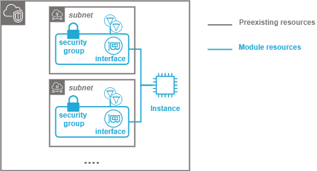

===================================
AWS virtual machine instance module
===================================

About The Project
=================

This project contains all the infrastructure as code (IaC) to deploy a virtual machine instance

.. image:: https://badgen.net/github/checks/nadegelemperiere-aws/module-aws-instance
   :target: https://github.com/nadegelemperiere-aws/module-aws-instance/actions/workflows/release.yml
   :alt: Status
.. image:: https://img.shields.io/static/v1?label=license&message=MIT&color=informational
   :target: ./LICENSE
   :alt: License
.. image:: https://badgen.net/github/commits/nadegelemperiere-aws/module-aws-instance/main
   :target: https://github.com/nadegelemperiere-aws/robotframework
   :alt: Commits
.. image:: https://badgen.net/github/last-commit/nadegelemperiere-aws/module-aws-instance/main
   :target: https://github.com/nadegelemperiere-aws/robotframework
   :alt: Last commit

Built With
----------

.. image:: https://img.shields.io/static/v1?label=terraform&message=1.6.4&color=informational
   :target: https://www.terraform.io/docs/index.html
   :alt: Terraform
.. image:: https://img.shields.io/static/v1?label=terraform%20AWS%20provider&message=5.26.0&color=informational
   :target: https://registry.terraform.io/providers/hashicorp/aws/latest/docs
   :alt: Terraform AWS provider

Getting Started
===============

Prerequisites
-------------

To date, terraform aws provider does not provide resources to handle AWS SSO Admin. SSO Admin shall have been manually activated in the account and the SSO groups shall have been created.

Configuration
-------------

To use this module in a wider terraform deployment, add the module to a terraform deployment using the following module:

.. code:: terraform

    module "group" {

        source      = "git::https://github.com/nadegelemperiere-aws/module-aws-instance?ref=<this module version>"
        project     = the project to which the permission set belongs to be used in naming and tags
        module      = the project module to which the permission set belongs to be used in naming and tags
        email       = the email of the person responsible for the permission set maintainance
        environment = the type of environment to which the permission set contributes (prod, preprod, staging, sandbox, ...) to be used in naming and tags
        git_version = the version of the deployment that uses the permission sets to be used as tag
        account     = the identifier of the account in which the permission set shall be created
        group       = {
            name     = *group name to give to the permission set related resources
            id       = group identifier in AWS SSO
            console  = Console url to which the group user shall be redirected after login to the SSO portal
        }
        rights      = [
            {
                description = description to give to the statement
                actions     = [ list of actions to allow the group users to do in AWS console
                    "s3:ListAllMyBuckets"
                ]
                resources   = [ list of resources to which permission applies
                    "*"
                ]
            }
        ]
        managed       = [ list of managed policies to give to user
            "arn:aws:iam::aws:policy/AWSSupportAccess",...
        ]
    }

Usage
-----

The module is deployed alongside the module other terraform components, using the classic command lines :

.. code:: bash

    terraform init ...
    terraform plan ...
    terraform apply ...

Detailed design
===============

Module creates a permission set in the local organization and attach it to the provided SSO group identifier, resulting in the creation of a dedicated role for group.

It creates a custom policy to gives the required rights to the SSO group in the local organization.

It can also attach already existing AWS managed policies

Testing
=======

Tested With
-----------

.. image:: https://img.shields.io/static/v1?label=aws_iac_keywords&message=v1.5.0&color=informational
   :target: https://github.com/nadegelemperiere-aws/robotframework
   :alt: AWS iac keywords
.. image:: https://img.shields.io/static/v1?label=python&message=3.12&color=informational
   :target: https://www.python.org
   :alt: Python
.. image:: https://img.shields.io/static/v1?label=robotframework&message=6.1.1&color=informational
   :target: http://robotframework.org/
   :alt: Robotframework
.. image:: https://img.shields.io/static/v1?label=boto3&message=1.29.3&color=informational
   :target: https://boto3.amazonaws.com/v1/documentation/api/latest/index.html
   :alt: Boto3

Environment
-----------

Tests can be executed in an environment :

* in which python and terraform has been installed, by executing the script `scripts/robot.sh`_, or

* in which docker is available, by using the `aws infrastructure image`_ in its latest version, which already contains python and terraform, by executing the script `scripts/test.sh`_

.. _`aws infrastructure image`: https://github.com/nadegelemperiere-docker/terraform-python-awscli
.. _`scripts/robot.sh`: scripts/robot.sh
.. _`scripts/test.sh`: scripts/test.sh

Strategy
--------

The test strategy consists in terraforming test infrastructures based on the permission set module and check that the resulting AWS infrastructure matches what is expected.
The tests currently contains 2 tests :

1 - A test to check the capability to create a permission set with some rights

2 - A test to check that when no permissions are specified, the permission set can still be created

The tests cases :

* Apply terraform to deploy the test infrastructure

* Use specific keywords to model the expected infrastructure in the boto3 format.

* Use shared SSO keywords relying on boto3 to check that the boto3 input matches the expected infrastructure

NB : It is not possible to completely specify the expected infrastructure, since some of the value returned by boto are not known before apply. The comparaison functions checks that all the specified data keys are present in the output, leaving alone the other undefined keys.

Results
-------

The test results for latest release are here_

.. _here: https://nadegelemperiere-aws.github.io/module-aws-instance/report.html

Issues
======

.. image:: https://img.shields.io/github/issues/nadegelemperiere-aws/module-aws-instance.svg
   :target: https://github.com/nadegelemperiere-aws/module-aws-instance/issues
   :alt: Open issues
.. image:: https://img.shields.io/github/issues-closed/nadegelemperiere-aws/module-aws-instance.svg
   :target: https://github.com/nadegelemperiere-aws/module-aws-instance/issues
   :alt: Closed issues

Roadmap
=======

N.A.

Contributing
============

.. image:: https://contrib.rocks/image?repo=nadegelemperiere-aws/module-aws-instance
   :alt: GitHub Contributors Image

We welcome contributions, do not hesitate to contact us if you want to contribute.

License
=======

This code is under MIT License.

Contact
=======

Nadege LEMPERIERE - nadege.lemperiere@gmail.com

Acknowledgments
===============

N.A.
